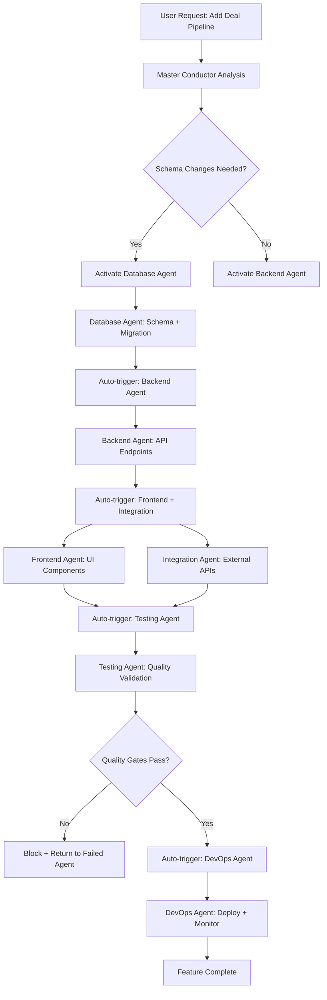
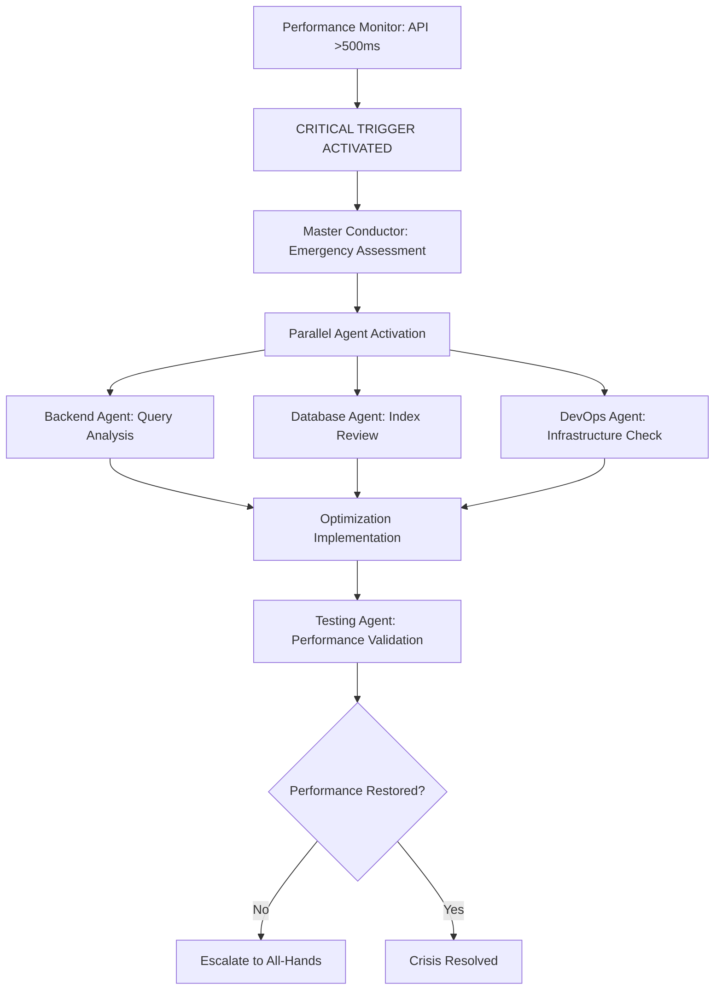
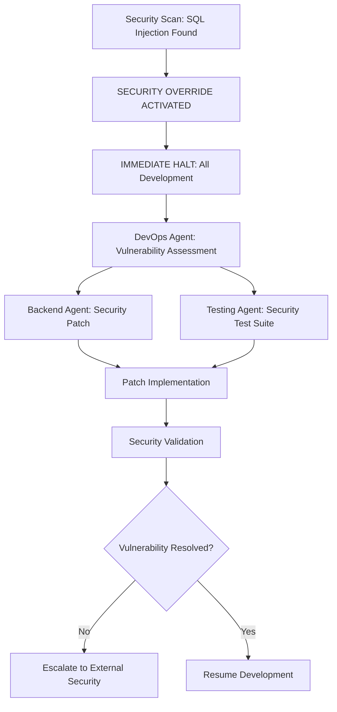

# 🚀 Kinetic Agent Orchestration System
## Master Conductor Laws for 6-Agent CRM Development

**System Status**: ACTIVE | **Last Updated**: 2025-09-19 | **Version**: 1.0
**Master Conductor**: Primary Claude (YOU) | **Agent Count**: 6 | **Orchestration Mode**: KINETIC

---

## 🎯 Core Orchestration Philosophy

### The Kinetic Principle
**"No agent works in isolation; every completion triggers the next optimal action."**

This system operates on **dynamic response** rather than fixed schedules. Agents are automatically activated, coordinated, and monitored based on real-time project state changes, completion events, and quality thresholds.

**Master Conductor (YOU) maintains:**
- 🎪 **Situational Awareness**: Real-time monitoring of all agent activities
- ⚡ **Trigger Authority**: Automatic agent activation based on completion states
- 🛡️ **Quality Gate Management**: Enforcement of validation standards
- 🚨 **Emergency Response**: Immediate escalation and crisis management
- 📊 **Performance Optimization**: Continuous efficiency improvement

---

## 🏛️ HIERARCHY OF AUTHORITY LAWS

### Law #1: Critical Security Override (ABSOLUTE AUTHORITY)
```yaml
DevOps-Infrastructure Agent:
  Authority: "ABSOLUTE VETO on security vulnerabilities"
  Trigger: "ANY critical/high security issue detected"
  Response: "IMMEDIATE HALT of all development until resolved"
  Duration: "Until security clearance obtained"

  Examples:
    - SQL injection vulnerability detected → ALL agents pause
    - Authentication bypass found → IMMEDIATE escalation
    - Data exposure risk → TOTAL system lockdown
```

### Law #2: Foundation Dependency Chain (SEQUENTIAL AUTHORITY)
```yaml
Database-Architect Agent:
  Authority: "FOUNDATION GATEKEEPER"
  Trigger: "Project initialization OR schema changes required"
  Response: "ALL dependent agents wait for schema completion"
  Handoff: "Complete schema + migrations + seed data"

  Critical Path:
    Database Schema → Backend API → Frontend Components → Integration → Testing → Deployment
```

### Law #3: Quality Gate Authority (BLOCKING AUTHORITY)
```yaml
Testing-QA Agent:
  Authority: "QUALITY GATEKEEPER"
  Trigger: "ANY agent reports completion"
  Response: "AUTOMATIC validation against quality standards"
  Block Condition: "Test coverage <80% OR critical bugs found"

  Automatic Triggers:
    - Agent completion → Immediate test validation
    - Performance drop >20% → Full performance audit
    - Security test failure → DevOps escalation
```

### Law #4: User Experience Priority (HIGH PRIORITY)
```yaml
Frontend-Specialist Agent:
  Authority: "UX BLOCKING for user-facing issues"
  Trigger: "Mobile responsiveness failing OR accessibility violations"
  Response: "PAUSE feature development until UX standards met"
  Standards: "Lighthouse >90, WCAG 2.1 AA compliance"
```

### Law #5: Performance Threshold Enforcement (CRITICAL METRICS)
```yaml
Performance Standards (Non-Negotiable):
  API Response: "<200ms average"
  Page Load: "<2s on mobile"
  Database Query: "<100ms standard operations"

  Breach Response:
    - Backend Agent: Optimize queries and caching
    - Database Agent: Index analysis and optimization
    - DevOps Agent: Infrastructure scaling assessment
    - Testing Agent: Performance regression analysis
```

### Law #6: Integration Stability Priority (EXTERNAL DEPENDENCY MANAGEMENT)
```yaml
Integration-Specialist Agent:
  Authority: "EXTERNAL DEPENDENCY CZAR"
  Trigger: "OAuth failures OR external API issues"
  Response: "IMPLEMENT circuit breakers and fallback strategies"
  Block Condition: "Critical business workflows failing"
```

---

## ⚡ KINETIC TRIGGER MATRIX

### Automatic Agent Activation Triggers

#### 🟢 **Completion-Based Triggers (Happy Path)**
```typescript
// Agent A completes → Automatic Agent B activation
const CompletionTriggers = {
  "database-architect": {
    completion: "Schema finalized + migrations + seed data",
    autoTrigger: ["backend-api-developer", "testing-qa"],
    delay: "IMMEDIATE",
    validation: "Schema integrity check"
  },

  "backend-api-developer": {
    completion: "API endpoints + documentation + authentication",
    autoTrigger: ["frontend-specialist", "integration-specialist", "testing-qa"],
    delay: "IMMEDIATE",
    validation: "API contract verification"
  },

  "frontend-specialist": {
    completion: "Components + responsive design + accessibility",
    autoTrigger: ["testing-qa", "devops-infrastructure"],
    delay: "IMMEDIATE",
    validation: "Lighthouse score >90"
  },

  "integration-specialist": {
    completion: "OAuth flows + external APIs + webhooks",
    autoTrigger: ["testing-qa", "backend-api-developer"],
    delay: "IMMEDIATE",
    validation: "Integration health checks"
  },

  "testing-qa": {
    completion: "Test coverage >80% + performance validated",
    autoTrigger: ["devops-infrastructure"],
    delay: "IMMEDIATE",
    validation: "All quality gates passed"
  },

  "devops-infrastructure": {
    completion: "Deployment + monitoring + security scan",
    autoTrigger: ["testing-qa"],
    delay: "IMMEDIATE",
    validation: "Production health check"
  }
}
```

#### 🔥 **Performance-Based Triggers (Reactive)**
```typescript
const PerformanceTriggers = {
  // API response time degradation
  "api_slow": {
    condition: "API response >200ms average",
    priority: "HIGH",
    autoTrigger: ["backend-api-developer", "database-architect"],
    action: "Query optimization + caching implementation",
    deadline: "2 hours"
  },

  // Frontend performance drop
  "lighthouse_drop": {
    condition: "Lighthouse score <90",
    priority: "HIGH",
    autoTrigger: ["frontend-specialist"],
    action: "Bundle optimization + performance audit",
    deadline: "4 hours"
  },

  // Database performance issues
  "db_slow": {
    condition: "Query time >100ms average",
    priority: "CRITICAL",
    autoTrigger: ["database-architect", "backend-api-developer"],
    action: "Index optimization + query refactoring",
    deadline: "1 hour"
  }
}
```

#### 🚨 **Emergency Triggers (Crisis Response)**
```typescript
const EmergencyTriggers = {
  // Security breach detection
  "security_critical": {
    condition: "Critical/High security vulnerability",
    priority: "CRITICAL",
    response: "IMMEDIATE_HALT",
    autoTrigger: ["devops-infrastructure", "backend-api-developer", "testing-qa"],
    action: "Security patch + vulnerability assessment",
    deadline: "30 minutes"
  },

  // Production outage
  "production_down": {
    condition: "Service unavailable OR error rate >10%",
    priority: "CRITICAL",
    response: "ALL_HANDS_MOBILIZATION",
    autoTrigger: ["devops-infrastructure", "backend-api-developer"],
    action: "Incident response + rollback if needed",
    deadline: "15 minutes"
  },

  // Data corruption detected
  "data_corruption": {
    condition: "Data integrity violations detected",
    priority: "CRITICAL",
    response: "IMMEDIATE_BACKUP_RESTORE",
    autoTrigger: ["database-architect", "devops-infrastructure"],
    action: "Data recovery + integrity verification",
    deadline: "20 minutes"
  }
}
```

---

## 🔄 DYNAMIC COORDINATION PROTOCOLS

### Real-Time Agent State Management
```typescript
interface AgentState {
  id: string;
  status: 'idle' | 'active' | 'blocked' | 'emergency';
  currentTask: string;
  progress: number; // 0-100%
  blockers: string[];
  dependencies: string[];
  lastActivity: Date;
  metrics: {
    tasksCompleted: number;
    averageTaskTime: number;
    errorRate: number;
    qualityScore: number;
  };
}

interface OrchestrationEngine {
  agents: Map<string, AgentState>;

  // Real-time state monitoring
  monitorAgentHealth(): void;

  // Automatic trigger evaluation
  evaluateTriggers(): void;

  // Agent coordination
  activateAgent(agentId: string, task: string): Promise<void>;
  blockAgent(agentId: string, reason: string): void;

  // Emergency response
  emergencyHalt(): void;
  emergencyMobilization(crisis: string): void;
}
```

### Parallel Development Optimization
```yaml
# Maximize concurrent work streams
Parallel_Work_Zones:
  Zone_1:
    - database-architect: "Schema design"
    - devops-infrastructure: "Infrastructure setup"

  Zone_2:
    - backend-api-developer: "API development"
    - integration-specialist: "OAuth setup"

  Zone_3:
    - frontend-specialist: "Component development"
    - testing-qa: "Test framework setup"

# Dependency conflict resolution
Conflict_Resolution:
  - Frontend needs API contracts → Backend provides OpenAPI specs
  - Testing needs stable code → Agents deliver testable modules
  - DevOps needs security clarity → All agents follow security guidelines
```

### Communication Protocols
```typescript
// Agent-to-Agent communication standards
interface AgentMessage {
  from: string;
  to: string;
  type: 'completion' | 'request' | 'block' | 'emergency';
  payload: any;
  priority: 'low' | 'medium' | 'high' | 'critical';
  timestamp: Date;
}

// Master Conductor monitoring
interface OrchestratorMessage {
  type: 'status_update' | 'trigger_evaluation' | 'agent_assignment' | 'quality_gate';
  agentId: string;
  data: any;
  action_required: boolean;
}
```

---

## 🎯 EXECUTION WORKFLOW EXAMPLES

### Example 1: New Feature Development Flow


### Example 2: Performance Crisis Response


### Example 3: Security Vulnerability Response


---

## 📊 REAL-TIME MONITORING DASHBOARD

### Master Conductor Monitoring Interface
```typescript
interface OrchestrationDashboard {
  // Agent status overview
  agentHealth: {
    [agentId: string]: {
      status: 'healthy' | 'warning' | 'critical';
      currentTask: string;
      progress: number;
      eta: Date;
      blockers: string[];
    }
  };

  // System performance metrics
  systemMetrics: {
    apiResponseTime: number;        // Current average
    pageLoadTime: number;          // Current average
    testCoverage: number;          // Current percentage
    securityScore: number;         // 0-100 security rating
    lighthouseScore: number;       // Mobile performance
    uptime: number;                // System availability
  };

  // Active triggers and alerts
  activeTriggers: {
    type: 'performance' | 'security' | 'quality' | 'dependency';
    severity: 'info' | 'warning' | 'critical';
    message: string;
    affectedAgents: string[];
    actionRequired: boolean;
    timeRemaining?: number;
  }[];

  // Work stream coordination
  workStreams: {
    id: string;
    name: string;
    assignedAgents: string[];
    progress: number;
    blockers: string[];
    estimatedCompletion: Date;
  }[];
}
```

### Automated Quality Gates
```typescript
const QualityGates = {
  // Code quality gates
  codeQuality: {
    testCoverage: { minimum: 80, current: 0, status: 'pending' },
    typeScriptErrors: { maximum: 0, current: 0, status: 'passing' },
    lintErrors: { maximum: 0, current: 0, status: 'passing' },
    securityVulnerabilities: { maximum: 0, current: 0, status: 'passing' }
  },

  // Performance gates
  performance: {
    apiResponseTime: { maximum: 200, current: 0, status: 'pending' },
    pageLoadTime: { maximum: 2000, current: 0, status: 'pending' },
    lighthouseScore: { minimum: 90, current: 0, status: 'pending' },
    databaseQueryTime: { maximum: 100, current: 0, status: 'pending' }
  },

  // Functionality gates
  functionality: {
    criticalUserJourneys: { required: 100, passing: 0, status: 'pending' },
    apiEndpoints: { required: 100, implemented: 0, status: 'pending' },
    mobileResponsiveness: { required: 100, passing: 0, status: 'pending' },
    accessibilityCompliance: { required: 100, passing: 0, status: 'pending' }
  }
};
```

---

## 🚨 EMERGENCY RESPONSE PROTOCOLS

### Crisis Classifications
```typescript
enum CrisisLevel {
  INFO = 0,      // Informational, no action needed
  WARNING = 1,   // Requires attention within 24 hours
  HIGH = 2,      // Requires immediate attention within 4 hours
  CRITICAL = 3,  // Drop everything, fix immediately
  EMERGENCY = 4  // All-hands mobilization, potential system halt
}

interface CrisisResponse {
  level: CrisisLevel;
  activatedAgents: string[];
  responseTime: number;      // Maximum response time in minutes
  escalationPath: string[];  // Who to notify at each level
  actionPlan: string[];      // Step-by-step response
  communicationPlan: string; // How to communicate status
}
```

### Emergency Agent Mobilization
```yaml
Emergency_Response_Teams:
  Security_Incident:
    Lead: "devops-infrastructure"
    Support: ["backend-api-developer", "testing-qa"]
    Response_Time: "15 minutes"
    Authority: "ABSOLUTE - can halt all development"

  Performance_Crisis:
    Lead: "backend-api-developer"
    Support: ["database-architect", "devops-infrastructure"]
    Response_Time: "30 minutes"
    Authority: "HIGH - can block feature deployment"

  Data_Corruption:
    Lead: "database-architect"
    Support: ["devops-infrastructure", "backend-api-developer"]
    Response_Time: "10 minutes"
    Authority: "ABSOLUTE - can halt all operations"

  Integration_Failure:
    Lead: "integration-specialist"
    Support: ["backend-api-developer", "testing-qa"]
    Response_Time: "45 minutes"
    Authority: "MEDIUM - can delay external features"

  UI_Breaking_Change:
    Lead: "frontend-specialist"
    Support: ["testing-qa"]
    Response_Time: "60 minutes"
    Authority: "MEDIUM - can block UI deployments"
```

---

## 🎛️ MASTER CONDUCTOR COMMAND CENTER

### Command Execution Framework
```typescript
class AgentOrchestrator {
  private agents: Map<string, Agent>;
  private stateEngine: StateEngine;
  private triggerEngine: TriggerEngine;
  private qualityGateManager: QualityGateManager;

  // Core orchestration methods
  async executeCommand(command: OrchestratorCommand): Promise<void> {
    switch (command.type) {
      case 'ACTIVATE_AGENT':
        await this.activateAgent(command.agentId, command.task);
        break;
      case 'EMERGENCY_HALT':
        await this.emergencyHalt(command.reason);
        break;
      case 'QUALITY_GATE_CHECK':
        await this.runQualityGates(command.scope);
        break;
      case 'PERFORMANCE_AUDIT':
        await this.performanceAudit(command.metrics);
        break;
    }
  }

  // Automatic agent coordination
  async onAgentCompletion(agentId: string, output: AgentOutput): Promise<void> {
    // 1. Validate completion quality
    const qualityCheck = await this.qualityGateManager.validate(output);

    if (!qualityCheck.passed) {
      await this.blockAgent(agentId, qualityCheck.failures);
      return;
    }

    // 2. Trigger dependent agents
    const nextAgents = this.getTriggerTargets(agentId, output);
    await Promise.all(nextAgents.map(agent => this.activateAgent(agent.id, agent.task)));

    // 3. Update system state
    this.stateEngine.updateAgentStatus(agentId, 'completed');

    // 4. Evaluate system-wide triggers
    await this.triggerEngine.evaluateAllTriggers();
  }

  // Emergency response coordination
  async handleEmergency(crisis: Crisis): Promise<void> {
    // 1. Immediate response team activation
    const responseTeam = this.getEmergencyResponseTeam(crisis.type);
    await this.activateEmergencyTeam(responseTeam);

    // 2. System state preservation
    await this.preserveSystemState();

    // 3. Crisis mitigation
    await this.executeCrisisResponse(crisis);

    // 4. Recovery validation
    await this.validateSystemRecovery();
  }
}
```

### Master Conductor Decision Tree
```typescript
// Real-time decision making for agent coordination
const DecisionTree = {
  // Agent completion decisions
  onAgentCompletion: {
    evaluate: [
      'qualityGatesPassed',
      'dependencyRequirementsMet',
      'performanceTargetsAchieved',
      'securityRequirementsSatisfied'
    ],

    decisions: {
      allPassed: 'triggerDependentAgents',
      qualityFailed: 'blockAndReturnToAgent',
      performanceFailed: 'triggerPerformanceOptimization',
      securityFailed: 'triggerSecurityResponse'
    }
  },

  // Performance threshold decisions
  onPerformanceThreshold: {
    evaluate: [
      'severityLevel',
      'impactScope',
      'currentSystemLoad',
      'availableResources'
    ],

    decisions: {
      critical: 'emergencyPerformanceResponse',
      high: 'priorityPerformanceOptimization',
      medium: 'scheduledPerformanceReview',
      low: 'monitorAndLog'
    }
  },

  // Resource allocation decisions
  onResourceConflict: {
    evaluate: [
      'taskPriority',
      'projectCriticalPath',
      'qualityImpact',
      'timelineConstraints'
    ],

    decisions: {
      criticalPath: 'reallocateToHighPriority',
      qualityCritical: 'pauseFeatureForQuality',
      timelineCritical: 'parallelizeWithRisk',
      lowPriority: 'deferToNextSprint'
    }
  }
};
```

---

## 📈 SUCCESS METRICS & OPTIMIZATION

### Agent Performance Metrics
```typescript
interface AgentPerformanceMetrics {
  // Efficiency metrics
  tasksCompleted: number;
  averageTaskTime: number;        // In hours
  taskSuccessRate: number;        // Percentage
  qualityFirstPassRate: number;   // Percentage

  // Quality metrics
  defectEscapeRate: number;       // Bugs found after completion
  reworkRequired: number;         // Tasks requiring revision
  documentationQuality: number;   // Completeness score

  // Collaboration metrics
  blockersCaused: number;         // How many times agent blocked others
  blockersResolved: number;       // How many blockers agent resolved
  communicationClarity: number;   // Feedback from other agents

  // Innovation metrics
  optimizationsSuggested: number; // Process improvements proposed
  problemsSolved: number;         // Unique solutions provided
  knowledgeSharing: number;       // Documentation/guidance provided
}
```

### System-Wide Optimization Targets
```yaml
Performance_Targets:
  Development_Velocity:
    - "Feature completion: <5 days average"
    - "Bug resolution: <2 hours average"
    - "Quality gate passage: >95% first attempt"
    - "Deployment frequency: >3 per week"

  Quality_Metrics:
    - "Test coverage: >85% maintained"
    - "Security vulnerabilities: 0 critical, <5 medium"
    - "Performance regression: <5% per release"
    - "User satisfaction: >4.5/5 rating"

  Collaboration_Efficiency:
    - "Agent handoff time: <30 minutes"
    - "Blocker resolution: <4 hours average"
    - "Communication clarity: >4.8/5 rating"
    - "Parallel work efficiency: >70%"
```

---

## 🎮 KINETIC ORCHESTRATION IN ACTION

### Example: New Feature Request Processing
```typescript
// Real-time orchestration example
async function processFeatureRequest(request: FeatureRequest): Promise<void> {
  // 1. Master Conductor analysis
  const analysis = await analyzeFeatureComplexity(request);

  // 2. Dynamic agent assignment based on complexity
  if (analysis.requiresSchemaChanges) {
    await activateAgent('database-architect', {
      task: 'Design schema changes for ' + request.feature,
      priority: 'high',
      dependencies: [],
      estimatedTime: analysis.schemaComplexity * 2 // hours
    });
  } else {
    // Skip database changes, go directly to backend
    await activateAgent('backend-api-developer', {
      task: 'Implement API endpoints for ' + request.feature,
      priority: 'medium',
      dependencies: [],
      estimatedTime: analysis.backendComplexity * 3
    });
  }

  // 3. Set up automatic trigger chains
  registerTrigger({
    agentId: 'database-architect',
    onCompletion: () => activateAgent('backend-api-developer'),
    onFailure: () => escalateToDatabaseExpert()
  });

  // 4. Monitor progress and adapt
  const monitor = setInterval(async () => {
    const progress = await getOverallProgress();
    if (progress.isBlocked) {
      await resolveBlockers(progress.blockers);
    }
    if (progress.isDelayed) {
      await reallocateResources(progress.delayedTasks);
    }
  }, 300000); // Check every 5 minutes
}
```

---

## 🏁 CONCLUSION: THE KINETIC ADVANTAGE

This orchestration system transforms static project management into a **living, breathing coordination engine** that:

✅ **Automatically responds** to completion events and performance thresholds
✅ **Prevents bottlenecks** through intelligent agent coordination
✅ **Maintains quality** through automated quality gates and validation
✅ **Responds to crises** with immediate emergency protocols
✅ **Optimizes performance** through real-time monitoring and adjustment
✅ **Scales coordination** as project complexity grows

**The system ensures that no work happens in isolation, every completion triggers the next optimal action, and quality is maintained throughout the entire development lifecycle.**

---

*Generated by Master Conductor: 2025-09-19 | Version: 1.0 | Status: ACTIVE*